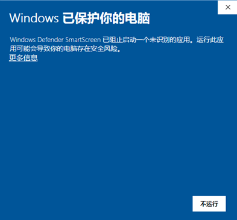
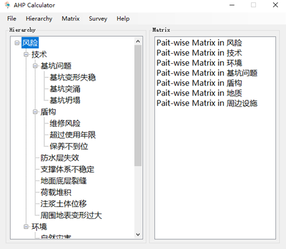
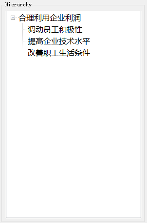
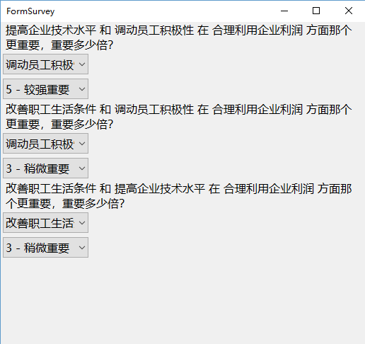
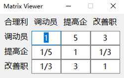
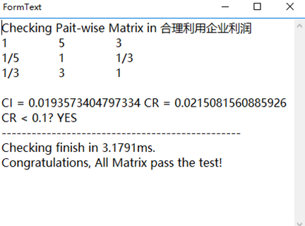
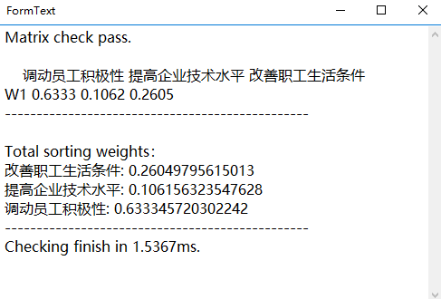

AHP_Calculator
==============
原本是做一个项目用到的层次分析法计算器，现在开源。

# 程序说明  
AHP Calculator是层次分析法计算器。它能够实现层次的建立，问卷的自动生成，成对比较矩阵自动填充，一致性检验，层次总排序，生成报告进而得到层次分析结果。

# 如何使用  

## 下载安装
程序使用了ClickOnce部署方法，目的是方便更新。不过好像把更新文件上传到服务器也挺累的2333。现在你可以在<a href="https://github.com/notonlyming/AHP_Calculator/releases" target="_blank">Release页面</a>下载

## 快速入门 🎓
在上面这个网址点击下载可执行文件。双击打开，期间可能会弹出筛选器的安全提示。  

  
这是由于程序没有购买证书，但程序来源是正确。因此，点击详细信息和仍然运行即可。安装完成后，安装程序会在桌面释放图标，并且自动打开程序。

## 使用方法  
### 界面
打开界面后，可以看到，程序分为两大部分。左边的是层次树，右边的是矩阵列表。  

  
下面将展示如何使用该程序建立一个基本例子来完成一次层次分析。  

### 建立层次
软件默认自带了一个建立好的层次。我们点击菜单栏上的Hierarchy-Clear，弹出提示:是否要重置项目，点击是。层次即被清空。接下来我们将使用菜单栏中的Hierarchy-Insert添加一个根节点。单击菜单后弹出输入框。这里我们填写“合理利用企业利润”。点击确定，一个根节点即被添加到层次树中。  

注意：一个项目中只能添加一个根节点，这是因为，层次分析法最终只能得到一组相对于根节点的权重，而不是两组。
然后，在层次树中选中刚刚添加的合理利用企业利润。再利用Hierarchy-Insert添加一个子节点。弹出输入框。填写为调动员工积极性。然后点击确定，一个子节点即被添加到根节点下。  

注意：每次添加子节点，都要在层次树中选中要添加子节点的父节点。否则程序将不知道要将节点添加到那个节点下。请始终记得在添加子节点前选择父节点。  

按照上面的方法，在根节点下再添加 提高企业技术水平 和 改善职工生活条件，添加完毕的层次树应该如下图所示：  

  

### 构建成对比较矩阵
在右侧的matrix空白区域右键，在弹出的菜单中点击Scan。弹出提示框。这是因为如果扫描，将会重新构造矩阵。矩阵个数可能会有变化，因此每次扫描都会清除原来的矩阵。这里因为我们从来没有扫描过。所以点“是”。此时程序会自动扫描层次，得到需要构建的所有成对比较矩阵。  

### 填充成对比较矩阵  
程序通过填写调查问卷的方式填充矩阵。在Matrix列表中左键选中第一条。右击Pair-Wise，打开调查问卷对话框。填写调查问卷，矩阵将会自动填充。调查问卷填写如下。  

  

每完成一题，更改都会保存到矩阵中，无需保存。填写完毕后，直接关闭调查问卷窗口即可。回到主窗口，在矩阵列表中双击第一条，可以看到刚刚填写的调查问卷已经映射到矩阵中。  

  

要点：使用鼠标悬浮在标签上可以查看因长度太长而被截断的文本。  
注意：程序设计为不能手动填充矩阵，这是因为手动填写矩阵容易出错。矩阵浏览窗口中的值是不能直接修改的。  

### 一致性检验
在矩阵列表任意位置右击，弹出菜单中选择Check。程序将对所有矩阵进行一致性检验（这里只有一个）并弹出报告窗口。  

  

### 层次总排序
当一致性检验通过后，即可进行层次总排序。点击菜单栏的Calculate-Generate report可进行层次总排序。至此，一次层次分析便完成了。  

  

### 保存
为了方便以后修改层次，修改问卷，进行再次分析计算。可以将文件保存。在0.1.1及以上的版本中，保存功能已经被合并。调用和保存只需进行一次。另外，如果修改层次，矩阵会被清除。若想保留之前的问卷，请记得使用问卷导出功能。  

# 程序反馈
如果程序使用有问题，请及时和作者反馈！😋